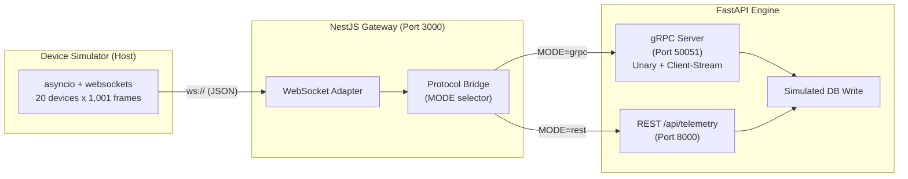
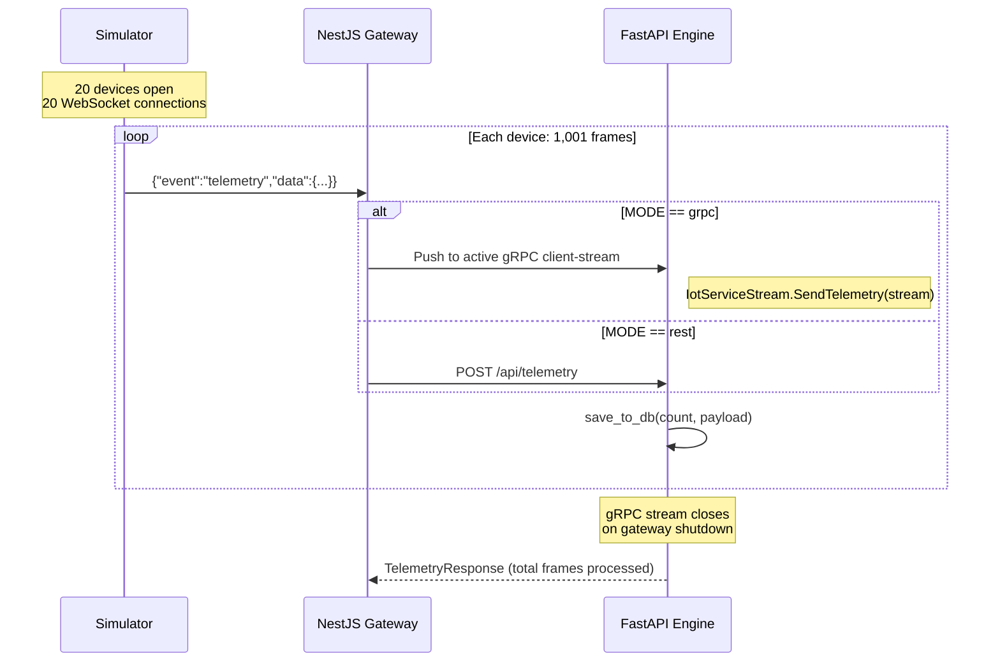

# gRPC IoT Telemetry Benchmark

> **A reproducible benchmark for high-throughput IoT telemetry ingestion, comparing gRPC (HTTP/2 client-streaming) against REST (HTTP/1.1) under identical payload conditions.**

[](https://www.python.org/)
[](https://fastapi.tiangolo.com/)
[](https://nestjs.com/)
[](https://grpc.io/)
[](https://www.docker.com/)

---

## Table of Contents

- [Overview](#overview)
- [Why This Matters](#why-this-matters)
- [Architecture](#architecture)
- [Technology Stack](#technology-stack)
- [Project Structure](#project-structure)
- [Data Flow](#data-flow)
- [Transport Comparison](#transport-comparison)
- [Protocol Contract](#protocol-contract)
- [Getting Started](#getting-started)
- [Running the Benchmark](#running-the-benchmark)
- [Configuration Reference](#configuration-reference)
- [Observed Behavior](#observed-behavior)
- [License](#license)

---

## Overview

This project demonstrates a complete IoT telemetry pipeline built to benchmark transport-layer efficiency. A Python-based device simulator emits **20,020 JSON telemetry frames** via WebSocket to a NestJS gateway. The gateway forwards each frame to a FastAPI engine using one of two transport modes:

- **gRPC client-streaming** over HTTP/2
- **REST POST** over HTTP/1.1

Both paths carry the same payload shapes, enabling an apples-to-apples comparison of serialization overhead, connection reuse, and throughput under load.

---

## Why This Matters

Modern IoT deployments routinely handle thousands of edge devices pushing high-frequency telemetry. The transport protocol choice directly impacts:

- **Latency** (connection setup vs. reuse)
- **Payload size** (binary Protobuf vs. text JSON)
- **Server resource consumption** (multiplexed streams vs. per-request sockets)

This demo isolates those variables by keeping the application logic identical across both paths.

---

## Architecture



### Key Design Decisions

| Decision | Rationale |
|----------|-----------|
| WebSocket ingress | Mirrors real-world IoT gateway patterns where devices maintain persistent connections |
| Simulated DB write | Keeps the benchmark focused on transport cost, not external database latency |
| Long-lived gRPC stream | The gateway opens a single client-stream at startup and pushes all frames through it, amortizing connection cost across the entire benchmark |
| Both engines active | FastAPI runs REST and gRPC concurrently; mode selection happens entirely in the gateway via environment variable |

---

## Technology Stack

| Layer | Technology | Responsibility | Exposed Port |
|-------|------------|----------------|--------------|
| **Simulator** | Python 3.13, `asyncio`, `websockets` | Generates load from the host machine | — |
| **Gateway** | NestJS 11, `@nestjs/platform-ws`, `@nestjs/microservices` | WebSocket termination, protocol routing | `3000` |
| **Engine** | FastAPI, `grpcio` (async), `uvicorn` | REST ingestion, gRPC servicers, simulated persistence | `8000` / `50051` |
| **Orchestration** | Docker Compose, bridge network | Service discovery, container isolation, reproducible builds | internal |

---

## Project Structure

```text
gRPC-demo/
├── docker-compose.yaml          # Service orchestration and environment
├── iot_data.proto               # Shared Protobuf contract (single source of truth)
├── iot_simulation.py            # Host-side load generator
├── .dockerignore                # Build context hygiene for both services
├── .gitignore
├── FastAPI-service/
│   ├── Dockerfile               # Multi-stage Python build, compiles proto from root
│   ├── requirements.txt         # Pinned Python dependencies
│   └── main.py                  # REST endpoints + gRPC unary/stream servicers
└── nestjs-service/
    ├── Dockerfile               # Multi-stage Node.js build, copies proto from root
    ├── package.json
    └── src/
        ├── main.ts              # HTTP server + WebSocket adapter binding
        ├── app.module.ts        # gRPC client configuration (channel options, keepalive)
        ├── app.controller.ts    # Placeholder controller
        ├── app.service.ts       # Placeholder service
        └── telemetry.gateway.ts # WebSocket event handler → gRPC/REST bridge
```

---

## Data Flow



### Frame Lifecycle

1. **Simulator** generates a JSON frame with a ~4 KB Base64 `status_payload` and timestamps it with `time.time_ns()`.
2. **Gateway** receives the WebSocket message, normalizes types (timestamp to string), and routes based on `MODE`.
3. **Engine** decodes the frame, computes delta time (`time.time_ns() - frame.timestamp`), logs metrics, and increments a counter.
4. **gRPC mode only**: After the gateway process terminates, the client-stream completes and the engine returns a single `TelemetryResponse` aggregating all processed frames.

---

## Transport Comparison

| Property | REST (HTTP/1.1) | gRPC (HTTP/2) |
|----------|-----------------|---------------|
| Serialization | JSON (text) | Protobuf (binary) |
| HTTP Version | 1.1 | 2 |
| Streaming | None (per-request) | Client-streaming |
| Connection Model | New TCP socket per request | Single multiplexed connection |
| Type Safety | Pydantic models at runtime | Generated `.pb2` stubs |
| Payload Efficiency | Verbose field names, string numbers | Compact binary, numeric tags |

> **Fairness constraint**: Both transports carry the exact same `status_payload` string (~4 KB). The benchmark measures transport and serialization overhead, not payload engineering differences.

### Engine Endpoints

The FastAPI engine registers **three** ingestion paths:

1. **`POST /api/telemetry`** — REST ingress via Pydantic-validated JSON.
2. **`IotService.SendTelemetry`** — Unary gRPC RPC (one request → one response). Available for targeted testing but not used by the gateway in this demo.
3. **`IotServiceStream.SendTelemetry`** — Client-streaming gRPC RPC (many requests → one response). This is the primary gRPC benchmark path.

---

## Protocol Contract

```protobuf
syntax = "proto3";

package iot;

service IotService {
  rpc SendTelemetry (TelemetryRequest) returns (TelemetryResponse);
}

service IotServiceStream {
  rpc SendTelemetry (stream TelemetryRequest) returns (TelemetryResponse);
}

message TelemetryRequest {
  string device_id = 1;
  double temperature = 2;
  double humidity = 3;
  string timestamp = 4;
  string status_payload = 5;
}

message TelemetryResponse {
  bool success = 1;
  string message = 2;
}
```

---

## Getting Started

### Prerequisites

- [Docker](https://docs.docker.com/engine/install/) + Docker Compose
- Python 3.13+ (for the simulator)
- `websockets` Python package (`pip install websockets`)

### 1. Start the services

```bash
docker compose up --build -d
```

This builds and starts:
- `fastapi_service` on ports `8000` (REST) and `50051` (gRPC)
- `nestjs_service` on port `3000` (WebSocket gateway)

### 2. Run the simulator

From the repository root (host machine):

```bash
pip install websockets
python iot_simulation.py
```

The simulator connects to `ws://127.0.0.1:3000` by default. Override via the
`WS_URL`, `DEVICE_NUMBER`, `PACKAGE_NUMBER`, and `DELAY` environment variables
when targeting a remote gateway.

### Expected Output

FastAPI engine logs will show lines like:

```text
[DB Write] Frame #42 | Delta time: 1523000 | Payload Bytes: 4096
count: 42
```

---

## Running the Benchmark

Switch the gateway transport mode by editing the environment variable in `docker-compose.yaml`:

```yaml
environment:
  - MODE=grpc   # or rest
```

Then recreate the gateway container:

```bash
docker compose up -d --force-recreate nestjs_service
```

Re-run the simulator for each mode and compare:
- **Total execution time** printed by the simulator
- **Per-frame delta time** printed by the engine
- **Container resource usage** (`docker stats`)

---

## Configuration Reference

### Runtime Environment Variables

| Variable | Default | Description |
|----------|---------|-------------|
| `MODE` | `grpc` | Transport mode: `grpc` uses client-streaming; `rest` uses HTTP POST |
| `REST_API_URL` | `http://fastapi_service:8000` | REST endpoint (Docker internal DNS) |
| `GRPC_API_URL` | `fastapi_service:50051` | gRPC endpoint (Docker internal DNS) |
| `PYTHONUNBUFFERED` | `1` | Unbuffered stdout for container logging |

### Simulator Parameters (env-overridable; defaults shown)

| Name | Default | Description |
|------|---------|-------------|
| `WS_URL` | `ws://127.0.0.1:3000` | WebSocket gateway URL |
| `DEVICE_NUMBER` | `20` | Concurrent virtual devices |
| `PACKAGE_NUMBER` | `1000` | Frames per device (the loop runs `range(PACKAGE_NUMBER + 1)`, yielding **1,001 frames per device**) |
| `DELAY` | `0.005` | Seconds between frames per device |
| `RAW_BYTES` | `os.urandom(1024 * 3)` | 3 KB random payload, Base64-encoded to ~4 KB |

### gRPC Channel Options

Defined in `nestjs-service/src/app.module.ts`:

| Option | Value | Purpose |
|--------|-------|---------|
| `grpc.keepalive_time_ms` | `120000` | Keepalive ping interval (2 min) |
| `grpc.keepalive_timeout_ms` | `60000` | Keepalive timeout (1 min) |
| `grpc.http2.min_time_between_pings_ms` | `10000` | Minimum time between HTTP/2 pings |
| `grpc.http2.max_pings_without_data` | `0` | Allow unlimited pings without data frames |
| `grpc.max_receive_message_length` | `10485760` | 10 MB inbound message cap |
| `grpc.max_send_message_length` | `10485760` | 10 MB outbound message cap |

---

## Observed Behavior

### gRPC Mode

- The gateway opens **one** client-stream connection at startup.
- All 20 WebSocket devices funnel frames into the same `RxJS Subject`, which feeds the gRPC stream.
- FastAPI receives frames continuously over HTTP/2, decodes Protobuf, and writes simulated DB logs via the stream servicer's instance counter.
- When the gateway container shuts down, the stream closes and FastAPI returns a single summary `TelemetryResponse`.

### REST Mode

- The gateway makes **one HTTP POST per frame** via `axios`.
- Each request opens (or reuses) an HTTP/1.1 connection to the FastAPI engine.
- FastAPI handles each request independently through the standard ASGI event loop.

### Known Characteristics

- **Total frames**: 20 devices x 1,001 frames = **20,020 frames**.
- **Payload size**: ~4 KB per frame (Base64-encoded 3 KB random block).
- **Simulator pacing**: `DELAY` seconds between frames per device (default `0.005`).
- **No persistence layer**: The "DB write" is a `print()` + counter increment to keep the benchmark CPU-bound and reproducible across environments.

---

## License

This repository is provided as an open-source benchmarking demo. You may fork, modify, and adapt it for your own protocol evaluation experiments.
