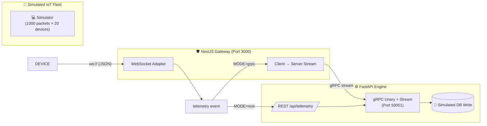
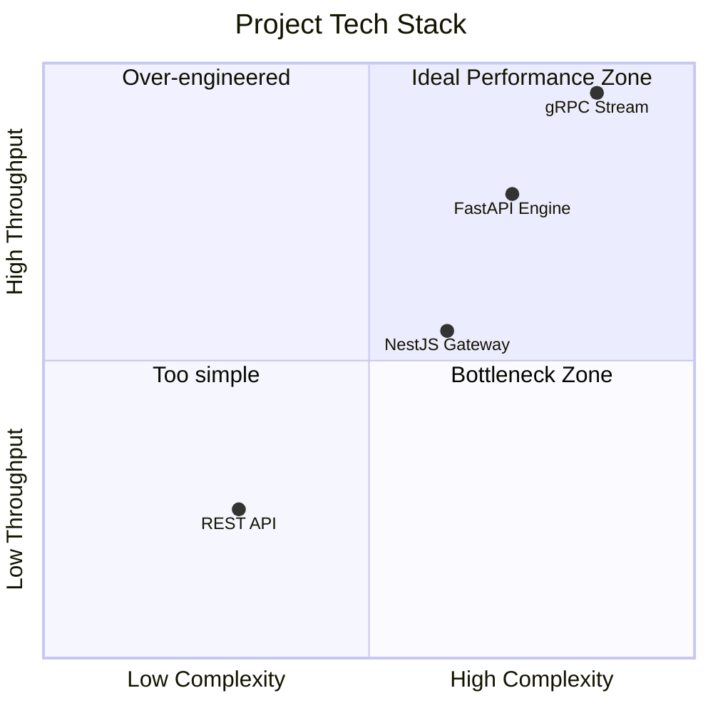
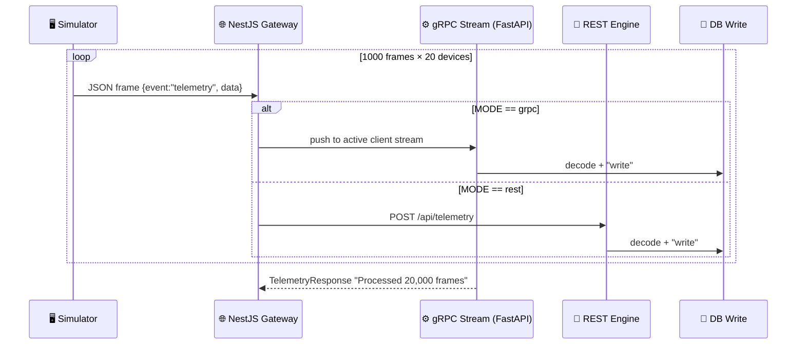
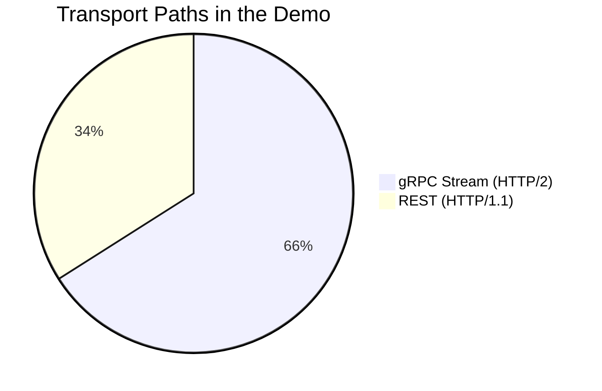
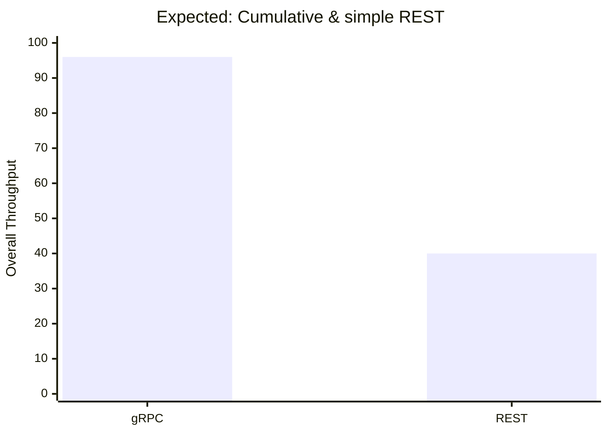

# 🚀 gRPC IoT Telemetry Demo

> **A high-throughput streaming architecture that pushes **20,000+ telemetry packets** through a WebSocket → Gateway → gRPC/REST pipeline** to benchmark the real-world difference between protocol transport layers.

[](https://www.python.org/)
[](https://fastapi.tiangolo.com/)
[](https://nestjs.com/)
[](https://grpc.io/)
[](https://www.docker.com/)

---

## 📌 Table of Contents

- [Why This Demo?](#-why-this-demo)
- [Architecture](#-architecture)
- [Technology Stack](#-technology-stack)
- [Project Structure](#-project-structure)
- [How Data Flows](#-how-data-flows)
- [The Two Transport Paths](#-the-two-transport-paths)
- [The .proto Contract](#-the-proto-contract)
- [Getting Started](#-getting-started)
- [Running a Benchmark](#-running-a-benchmark)
- [Configuration Reference](#-configuration-reference)
- [License](#-license)

---

## 💡 Why This Demo?

Modern IoT systems juggle **thousands of devices** pushing millions of data points. The way those packets cross the wire matters enormously for cost and latency. This project builds a complete, realistic IoT pipeline and lets you flip a single environment variable to compare:

| Transport | Pros | Cons |
|-----------|------|------|
| ⚡ **gRPC (HTTP/2)** | Binary serialization, multiplexed streams, typed contract, ~10x smaller payloads | Slightly more complex setup |
| 🐌 **REST (HTTP/1.1)** | Ubiquitous, human-readable JSON, dead simple | Text overhead, no built-in streaming, repeated connection setup |

> **The catch** — both paths carry the *same* ~4KB `status_payload` field per frame, so you're benchmarking pure **transport efficiency**, not payload differences.

---

## 🏗️ Architecture



---

## 🧱 Technology Stack



| Layer | Tech | Role | Port |
|-------|------|------|------|
| 🖥️ **Client Simulator** | `asyncio` + `websockets` | Fires 20,000 telemetry frames | — |
| 🌐 **Gateway** | NestJS + `@nestjs/platform-ws` | WebSocket entry, protocol bridge | `3000` |
| ⚙️ **Engine** | FastAPI + `grpcio` (async) | REST + gRPC ingestion, DB write | `8000` / `50051` |
| 🔁 **Delivery** | Docker Compose bridge network | Service discovery & isolation | internal |

---

## 📁 Project Structure

```text
gRPC-demo/
├── docker-compose.yaml          # Orchestrates both services on a shared network
├── iot_data.proto               # 📜 Shared gRPC contract (source of truth)
├── iot_simulation.py            # 🖥️ IoT device simulator (20 devices × 1000 frames)
├── FastAPI-service/
│   ├── Dockerfile
│   ├── iot_data.proto
│   └── main.py                  # ⚙️ REST + gRPC (unary & stream) engine
└── nestjs-service/
    ├── Dockerfile
    ├── iot_data.proto
    └── src/
        ├── main.ts              # 🌐 Binds native HTTP → WsAdapter
        ├── app.module.ts        # 🔌 Registers gRPC ClientGrpc (IOT_PACKAGE)
        └── telemetry.gateway.ts # 🛡️ WebSocket ↔ gRPC/REST bridge
```

---

## 🔄 How Data Flows



**Stress-tuned HTTP/2 channel options** in `app.module.ts:19`:
- Keepalive pinned so the long-lived stream never drops under load.
- Message size caps lifted to **10 MB** to avoid packet fragmentation.
- Ping throttling tuned to respect HTTP/2 compliance.

---

## 🛤️ The Two Transport Paths



| Aspect | 🚡 REST | ⚡ gRPC |
|--------|---------|--------|
| Fuel | JSON (text) | Protobuf (binary) |
| HTTP | 1.1 | 2 |
| Streaming | ❌ | ✅ client-streaming |
| Type Safety | Manual `pydantic` | Generated `.pb2` stubs |
| Open Connection | New per request | Single multiplexed pipe |
| Payload Size | Large | Compact |

---

## 📜 The .proto Contract

```proto
syntax = "proto3";

package iot;

service IotService {
  rpc SendTelemetry (TelemetryRequest) returns (TelemetryResponse);
}

service IotServiceStream {
  rpc SendTelemetry (stream TelemetryRequest) returns (TelemetryResponse);
}

message TelemetryRequest {
  string device_id = 1;
  double temperature = 2;
  double humidity = 3;
  string timestamp = 4;
  string status_payload = 5;
}

message TelemetryResponse {
  bool success = 1;
  string message = 2;
}
```

> **Two service definitions** 🎁 The engine registers **both** the classic *unary* RPC and the *client-streaming* RPC, so you can benchmark `1 request ↔ 1 response` vs. `N requests → 1 response`.

---

## 🚀 Getting Started

### Prerequisites
- [Docker](https://www.docker.com/products/docker-desktop/) + Docker Compose
- Python 3.13+ (for the simulator)

### 1. Spin up the stack
```bash
docker compose up --build -d
```

### 2. Run the simulator
```bash
pip install websockets
python iot_simulation.py
```

That's it — you'll see frames logging `[DB Write] Frame #N | Delta time: … | Payload Bytes: 4096` in the FastAPI logs.

---

## 📊 Running a Benchmark

To compare transports, just flip the mode and restart the gateway:

```bash
# Default: gRPC streaming
docker compose up -d nestjs_service

# OR switch to REST and restart
#  edit docker-compose.yaml: MODE=rest
docker compose up -d --force-recreate nestjs_service
```



---

## ⚙️ Configuration Reference

| Variable | Default | Description |
|----------|---------|-------------|
| `MODE` | `grpc` | `grpc` → client-streaming · `rest` → HTTP API calls |
| `REST_API_URL` | `http://fastapi_service:8000` | REST engine endpoint |
| `GRPC_API_URL` | `fastapi_service:50051` | gRPC engine endpoint |
| `PYTHONUNBUFFERED` | `1` | Flush container logs instantly |

`docker-compose.yaml` sim parameters (in `iot_simulation.py`):
| Name | Value | Meaning |
|------|-------|---------|
| `DEVICE_NUMBER` | `20` | Concurrent virtual IoT devices |
| `PACKAGE_NUMBER` | `1000` | Frames per device |
| `BIG_PAYLOAD_STRING` | ~4 KB | Heavy binary telemetry dump |
| `DELAY` | `0.01s` | Inter-frame pacing |

---

## 📄 License

This is an open-source demo. Feel free to fork and adapt it to your own benchmarking experiments.